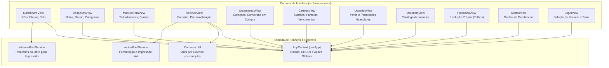

# Diagrama C4 — Componentes (Nível 3) — SISTEMA LIBRA - OBRAS

> Gerado pelo **Architect** em 2026-11-13

```mermaid
flowchart TD
    subgraph UIComponents["Camada de Interface (src/components)"]
        DashboardView["DashboardView\nKPIs, Etapas, Teto"]
        DespesasView["DespesasView\nNotas, Rateio, Categorias"]
        MaoDeObraView["MaoDeObraView\nTrabalhadores, Diárias"]
        RecibosView["RecibosView\nEmissão, Pré-visualização"]
        OrcamentosView["OrcamentosView\nCotações, Conversão em Compra"]
        CartoesView["CartoesView\nCartões, Parcelas, Vencimentos"]
        UsuariosView["UsuariosView\nPerfis e Permissões Granulares"]
        MateriaisView["MateriaisView\nCatálogo de Insumos"]
        ProducaoView["ProducaoView\nProdução Própria (Trilhos)"]
        AlertasView["AlertasView\nCentral de Pendências"]
        AuthView["LoginView\nSeleção de Usuário e Tema"]
    end

    subgraph CoreServices["Camada de Serviços & Contexto"]
        AppContext["AppContext (useApp)\nEstado, CRUDs e Ações Globais"]
        CurrencyUtil["Currency Util\nValor por Extenso (currency.ts)"]
        ReciboPrint["reciboPrintService\nFormatação e Impressão A4"]
        RelatorioPrint["relatorioPrintService\nRelatórios da Obra para Impressão"]
    end

    DashboardView --> AppContext
    DespesasView --> AppContext
    MaoDeObraView --> AppContext
    OrcamentosView --> AppContext
    CartoesView --> AppContext
    UsuariosView --> AppContext
    MateriaisView --> AppContext
    ProducaoView --> AppContext
    AlertasView --> AppContext
    AuthView --> AppContext

    RecibosView --> AppContext
    RecibosView --> CurrencyUtil
    RecibosView --> ReciboPrint
    DashboardView --> RelatorioPrint
```

