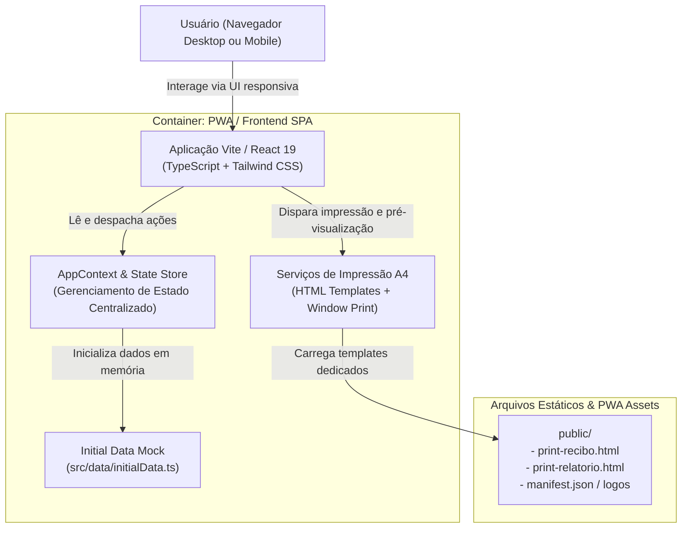

# Diagrama C4 — Containers (Nível 2) — SISTEMA LIBRA - OBRAS

> Gerado pelo **Architect** em 2026-11-13

```mermaid
flowchart TD
    Usuario["Usuário (Navegador Desktop ou Mobile)"]

    subgraph ContainerPWA["Container: PWA / Frontend SPA"]
        ViteApp["Aplicação Vite / React 19\n(TypeScript + Tailwind CSS)"]
        AppContext["AppContext & State Store\n(Gerenciamento de Estado Centralizado)"]
        LocalData["Initial Data Mock\n(src/data/initialData.ts)"]
        PrintService["Serviços de Impressão A4\n(HTML Templates + Window Print)"]
    end

    subgraph ArquivosEstaticos["Arquivos Estáticos & PWA Assets"]
        PublicAssets["public/\n- print-recibo.html\n- print-relatorio.html\n- manifest.json / logos"]
    end

    Usuario -->|Interage via UI responsiva| ViteApp
    ViteApp -->|Lê e despacha ações| AppContext
    AppContext -->|Inicializa dados em memória| LocalData
    ViteApp -->|Dispara impressão e pré-visualização| PrintService
    PrintService -->|Carrega templates dedicados| PublicAssets
```

