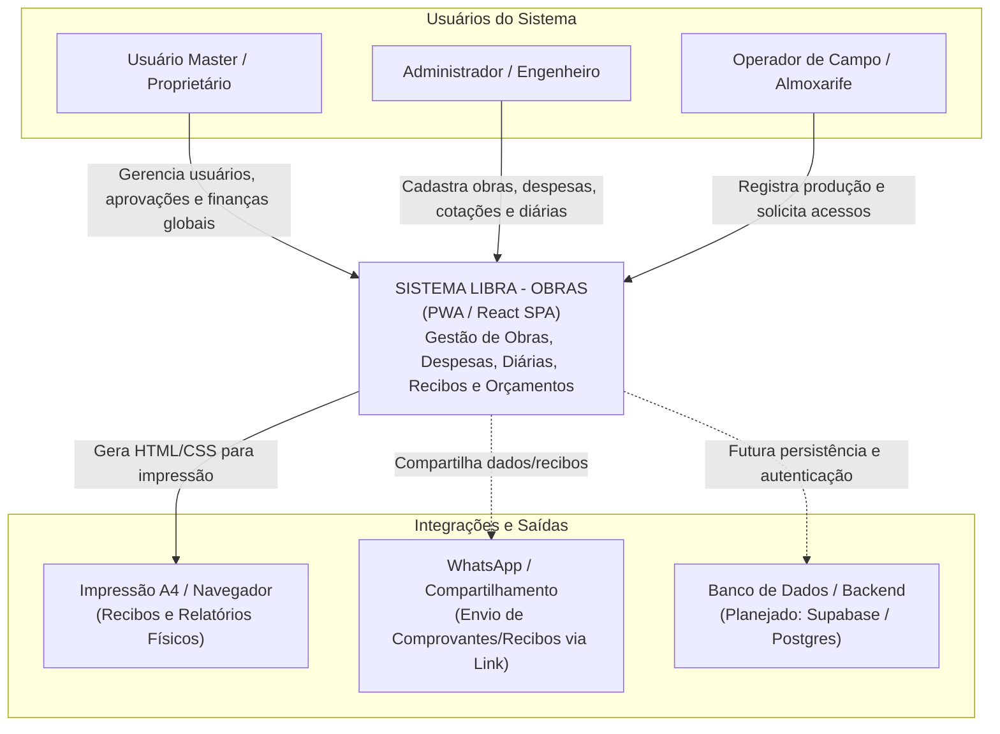

# Diagrama C4 — Contexto (Nível 1) — SISTEMA LIBRA - OBRAS

> Gerado pelo **Architect** em 2026-11-13

```mermaid
flowchart TD
    subgraph Usuarios["Usuários do Sistema"]
        Master["Usuário Master / Proprietário"]
        Admin["Administrador / Engenheiro"]
        Operador["Operador de Campo / Almoxarife"]
    end

    Sistema["SISTEMA LIBRA - OBRAS\n(PWA / React SPA)\nGestão de Obras, Despesas, Diárias, Recibos e Orçamentos"]

    subgraph Externos["Integrações e Saídas"]
        Impressao["Impressão A4 / Navegador\n(Recibos e Relatórios Físicos)"]
        WhatsApp["WhatsApp / Compartilhamento\n(Envio de Comprovantes/Recibos via Link)"]
        BancoFuturo["Banco de Dados / Backend\n(Planejado: Supabase / Postgres)"]
    end

    Master -->|Gerencia usuários, aprovações e finanças globais| Sistema
    Admin -->|Cadastra obras, despesas, cotações e diárias| Sistema
    Operador -->|Registra produção e solicita acessos| Sistema

    Sistema -->|Gera HTML/CSS para impressão| Impressao
    Sistema -.->|Compartilha dados/recibos| WhatsApp
    Sistema -.->|Futura persistência e autenticação| BancoFuturo
```

