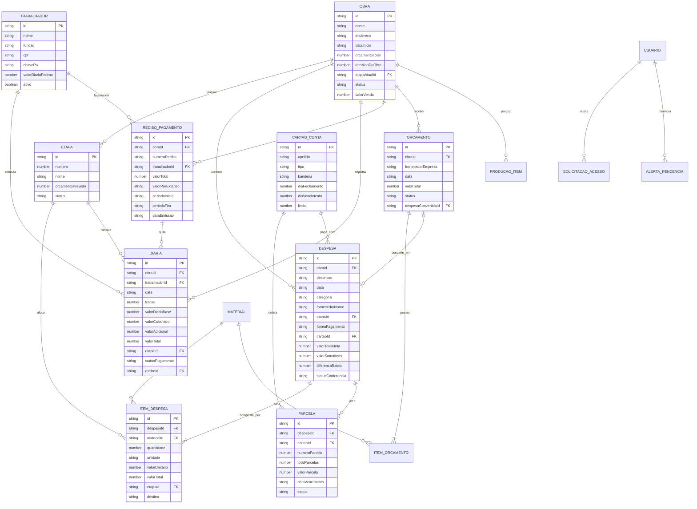

# Diagrama Entidade-Relacionamento Completo (ERD) — SISTEMA LIBRA - OBRAS

> Gerado pelo **Architect** em 2026-11-13

```mermaid
erDiagram
    OBRA ||--o{ ETAPA : "possui"
    OBRA ||--o{ DESPESA : "contem"
    OBRA ||--o{ DIARIA : "registra"
    OBRA ||--o{ RECIBO_PAGAMENTO : "emite"
    OBRA ||--o{ ORCAMENTO : "recebe"
    OBRA ||--o{ PRODUCAO_ITEM : "produz"

    ETAPA ||--o{ ITEM_DESPESA : "aloca"
    ETAPA ||--o{ DIARIA : "vincula"

    DESPESA ||--|{ ITEM_DESPESA : "composta_por"
    DESPESA ||--o{ PARCELA : "gera"
    CARTAO_CONTA ||--o{ PARCELA : "debita"
    CARTAO_CONTA ||--o{ DESPESA : "paga_com"

    MATERIAL ||--o{ ITEM_DESPESA : "utiliza"
    MATERIAL ||--o{ ITEM_ORCAMENTO : "cota"

    TRABALHADOR ||--o{ DIARIA : "executa"
    TRABALHADOR ||--o{ RECIBO_PAGAMENTO : "favorecido"

    RECIBO_PAGAMENTO ||--o{ DIARIA : "quita"

    ORCAMENTO ||--|{ ITEM_ORCAMENTO : "possui"
    ORCAMENTO |o--o| DESPESA : "converte_em"

    USUARIO ||--o{ SOLICITACAO_ACESSO : "revisa"
    USUARIO ||--o{ ALERTA_PENDENCIA : "monitora"

    OBRA {
        string id PK
        string nome
        string endereco
        string dataInicio
        number orcamentoTotal
        number tetoMaoDeObra
        string etapaAtualId FK
        string status
        number valorVenda
    }

    ETAPA {
        string id PK
        number numero
        string nome
        number orcamentoPrevisto
        string status
    }

    DESPESA {
        string id PK
        string obraId FK
        string descricao
        string data
        string categoria
        string fornecedorNome
        string etapaId FK
        string formaPagamento
        string cartaoId FK
        number valorTotalNota
        number valorSomaItens
        number diferencaRateio
        string statusConferencia
    }

    ITEM_DESPESA {
        string id PK
        string despesaId FK
        string materialId FK
        number quantidade
        string unidade
        number valorUnitario
        number valorTotal
        string etapaId FK
        string destino
    }

    TRABALHADOR {
        string id PK
        string nome
        string funcao
        string cpf
        string chavePix
        number valorDiariaPadrao
        boolean ativo
    }

    DIARIA {
        string id PK
        string obraId FK
        string trabalhadorId FK
        string data
        number fracao
        number valorDiariaBase
        number valorCalculado
        number valorAdicional
        number valorTotal
        string etapaId FK
        string statusPagamento
        string reciboId FK
    }

    RECIBO_PAGAMENTO {
        string id PK
        string obraId FK
        string numeroRecibo
        string trabalhadorId FK
        number valorTotal
        string valorPorExtenso
        string periodoInicio
        string periodoFim
        string dataEmissao
    }

    ORCAMENTO {
        string id PK
        string obraId FK
        string fornecedorEmpresa
        string data
        number valorTotal
        string status
        string despesaConvertidaId FK
    }

    CARTAO_CONTA {
        string id PK
        string apelido
        string tipo
        string bandeira
        number diaFechamento
        number diaVencimento
        number limite
    }

    PARCELA {
        string id PK
        string despesaId FK
        string cartaoId FK
        number numeroParcela
        number totalParcelas
        number valorParcela
        string dataVencimento
        string status
    }
```

